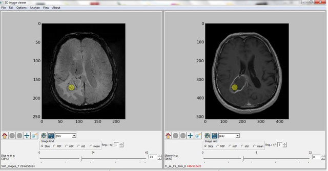
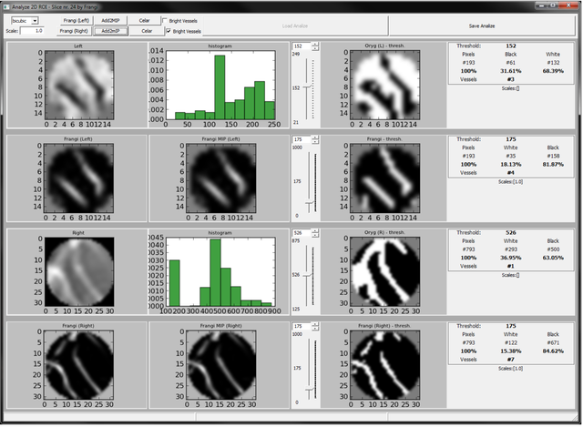

# brain-tumor-vascularization
# SWI-based analysis of brain tumor vascularity and malignancy grading using custom VesselView software.
## Repository contains implementation of novel imaging-based tumor assessment methods.

Susceptibility Weighted Imaging (SWI) is an advanced MRI sequence that combines filtered phase and magnitude data to visualize susceptibility differences between adjacent tissues. This technique effectively reveals blood products, hemorrhages, iron deposits, and calcium that are poorly visible in conventional MRI sequences.

The study aimed to:
1. Evaluate SWI's usefulness compared to standard MRI sequences for brain tumor morphology assessment
2. Determine SWI's potential for grading brain tumors
3. Validate the authors' computer application "VesselView" for objective assessment of intratumoral vascularity

The research included 63 patients with primary and secondary brain tumors. All MRI examinations were performed using a 12-channel phased array head coil in a 1.5T scanner. The imaging protocol included standard T2, FLAIR, T1, and contrast-enhanced T1 (CET1) sequences, with SWI performed before contrast administration.

<table align="center">
  <tr><td></td></tr>
  <tr><td align="center"><i>Fig. 1: Selected slice of Contrast-enhanced T1 sequence and SWI without contrast</i></td></tr>
</table>

Results showed that all sequences, including SWI, performed similarly in assessing tumor size and mass effect. T2 sequence excelled in visualizing peritumoral edema. Tumor boundaries were best depicted in CET1, closely followed by SWI. Notably, SWI was significantly superior in visualizing low-signal structures compared to other sequences.

<table>
  <tr><td></td></tr>
  <tr><td align="center">Fig. 1: Result analysis window</td></tr>
</table>

Comparative analysis of SWI and CET1 regarding intratumoral vessels, performed both subjectively (vessel quantity and "malignancy index") and using the VesselView software, demonstrated SWI's advantage in this area. When comparing both sequences for tumor grading using the malignancy index, SWI showed stronger correlation with tumor grade.

The authors emphasize that SWI is a valuable sequence for tumor evaluation, accurately assessing tumor size and impact on surrounding structures while visualizing blood products and intratumoral vasculature. A significant advantage is obtaining this information without intravenous contrast agents.

Conclusions:
1. SWI sequence provides more precise evaluation of brain tumors regarding vascularity and visualization of blood products in areas of hemorrhages, microhemorrhages, and calcifications
2. The VesselView application represents an initial attempt to create an objective method for evaluating vascular structures within tumors
3. SWI sequence allows more accurate assessment of brain tumor malignancy

---

Publications:
1. An attempt toward objective assessment of brain tumor vascularization using susceptibility weighted imaging and dedicated computer program - preliminary study, J. Wieczorek-Pastusiak, M. Kociński, M. Raźniewski, M. Strzelecki, L. Stefańczyk, A.Majos, Polish Journal of Radiology, Vol. 78(1):50-56, 2013, (MNiSW: 2016-15 pkt., 2013-7 pkt.) :doi:10.12659/PJR.883767 ([link](https://pubmed.ncbi.nlm.nih.gov/23493465/))

2. The usefulness of SWI and authors’ computer application in assessment of brain tumors vascularisation, (Przydatność sekwencji SWI i autorskiej aplikacji komputerowej w ocenie unaczynienia guzów mózgu), J. Wieczorek-Pastusiak, M. Kociński, M. Raźniewski, M. Strzelecki, L. Stefańczyk, A. Majos – Polish Journal of Radiology, Vol. 78 (suppl.1):49- 203, June 2013, (MNiSW: 2015-15 pkt., 2013-7, pkt.) 

3. Susceptibility-weighted imaging with the aid of dedicated software in assessment of brain tumors vascularization, p. 3190, A. Majos, J. Wieczorek-Pastusiak, M. Kociński, M. Strzelecki, L. Stefańczyk, 20th Annual Meeting International Society for Magnetic Resonance (ISMRM) in Medicine, Melbourne, Australia, May 2012 ([link](https://cds.ismrm.org/protected/12MProceedings/PDFfiles/3190.pdf))
4. Wartość sekwencji SWI w badaniach metodą Rezonansu Magnetycznego w ocenie guzów nowotworowych ośrodkowego układu nerwowego, PhD dissertation, Medical University of Lodz, Poland, 2013
